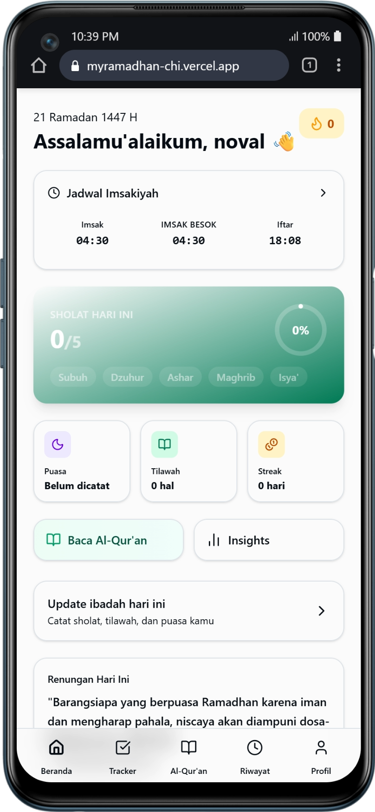
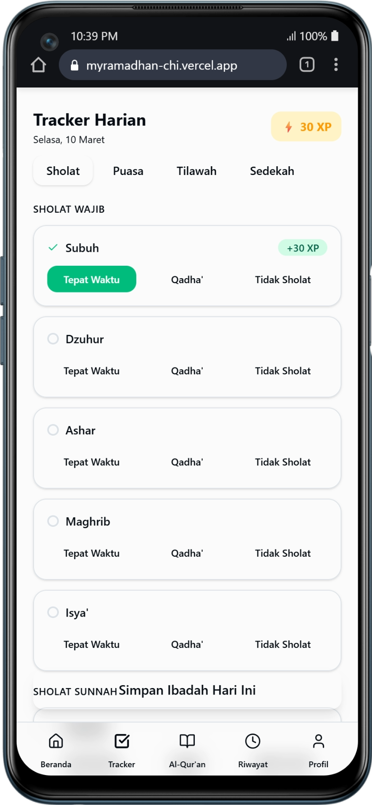
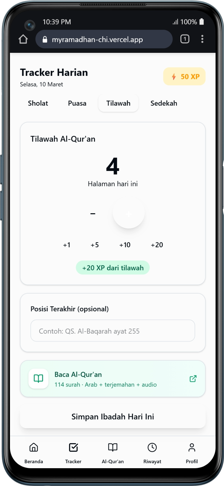
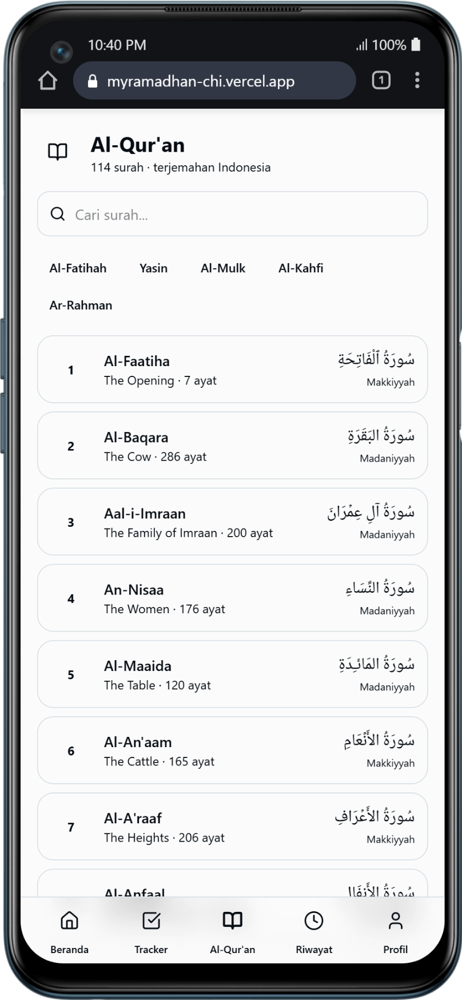
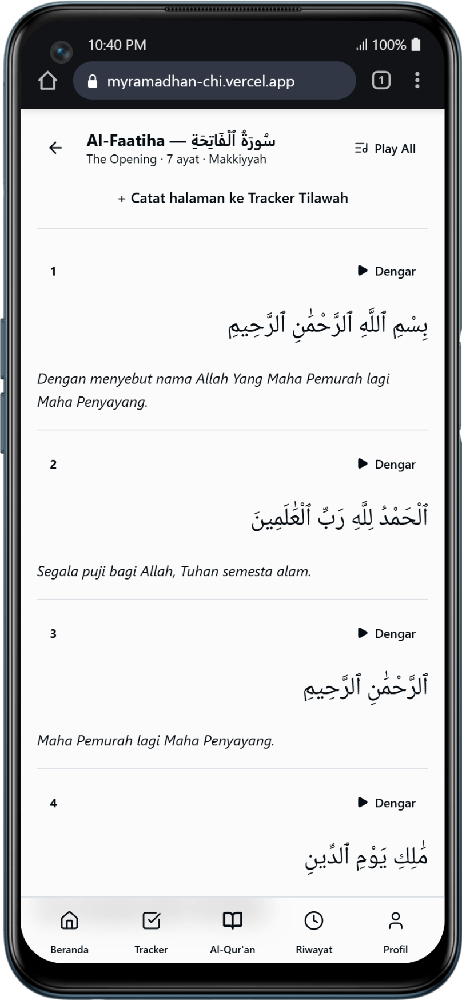
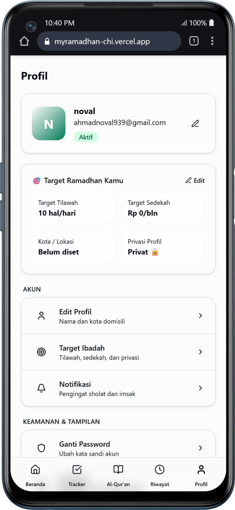
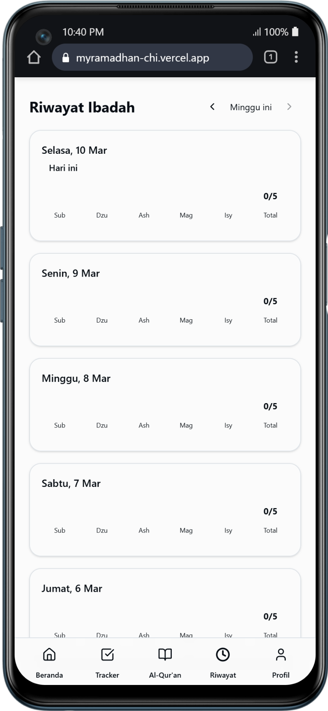
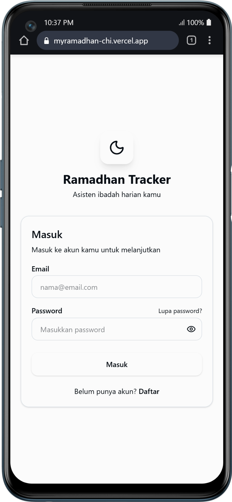

<div align="center">

# 🌙 Ramadhan Tracker

**Asisten ibadah harian kamu selama Ramadhan**

A full-featured Progressive Web App (PWA) to help Muslims track their daily worship during the holy month of Ramadhan — including prayers, fasting, Quran reading, and charity — with gamification, streak tracking, and a built-in Quran reader.

[](https://myramadhan-chi.vercel.app)
[](https://react.dev)
[](https://www.typescriptlang.org)
[](https://supabase.com)
[](https://vite.dev)

</div>

---

## 📸 Screenshots

<div align="center">

| Home | Tracker (Sholat) | Tracker (Tilawah) |
|------|-----------------|-------------------|
|  |  |  |

| Al-Qur'an | Surah Detail | Profile |
|---|---|---|
|  |  |  |

| Riwayat Ibadah | Login |
|---|---|
|  |  |

</div>

---

## ✨ Features

### 🕌 Daily Worship Tracker
- **Sholat Wajib** — Log each of the 5 obligatory daily prayers (Subuh, Dzuhur, Ashar, Maghrib, Isya') with one of three statuses: **Tepat Waktu**, **Qadha'**, or **Tidak Sholat**
- **Sholat Sunnah** — Track optional prayers: Tarawih, Witir, Dhuha, and Qiyamul Lail
- **Puasa (Fasting)** — Record fasting status: full, partial, or skipped
- **Tilawah Al-Qur'an** — Log Quran pages read per day with quick-add buttons (+1, +5, +10, +20) and optional last position note
- **Sedekah (Charity)** — Record daily charity donations with amount, channel, and notes

### 📖 Built-in Al-Qur'an Reader
- All **114 surahs** with Arabic text (Uthmani script)
- **Indonesian translation** for every ayah
- Per-ayah **audio playback** (via AlQuran.cloud API)
- **Play All** mode for continuous recitation
- **Quick-access shortcuts** for popular surahs (Al-Fatihah, Yasin, Al-Mulk, Al-Kahfi, Ar-Rahman)
- Search surahs by name
- **One-tap integration** to record pages to Tilawah Tracker

### 🕐 Jadwal Imsakiyah
- Accurate prayer times fetched from **Aladhan API** (Method 11 — Moonsighting Committee Worldwide, closest to MUI/Indonesia)
- Shows Imsak, Fajr, Dhuhr, Asr, Maghrib, and Isha times
- Displays today's and tomorrow's Imsak time prominently on the Home screen
- Hijri date display (e.g., "21 Ramadhan 1447 H")

### 🎮 Gamification & Streaks
- **XP System** — Earn XP for every ibadah logged (e.g., +30 XP for on-time prayers, +20 XP from Tilawah)
- **Streak Counter** — Track consecutive days of ibadah completion
- **Badges** — Unlock achievement badges for milestones
- Total XP displayed prominently on the Tracker page

### 📊 Riwayat & Insights
- **Weekly History** — Browse your ibadah records week-by-week with forward/back navigation
- Per-day cards showing prayer status (Sub, Dzu, Ash, Mag, Isy) and totals
- **Insights page** — Analytics and visualizations of your Ramadhan progress

### 👤 Profile & Settings
- Display name, email, and avatar (initial-based)
- **Target Ramadhan** — Set personal targets for daily Tilawah pages, monthly charity amount, city/location, and profile privacy (public/private)
- **Edit Profil** — Update display name and city
- **Notifikasi** — Prayer and Imsak reminder settings
- **Ganti Password** — Change account password

### 🔐 Authentication
- Email/password registration and login via **Supabase Auth**
- **Forgot password** flow with email reset
- Protected routes — all app pages require authentication
- Auto-profile creation on user signup via database trigger

### 📱 Progressive Web App (PWA)
- Installable on Android and iOS — works like a native app
- **Offline support** via IndexedDB (`idb`)
- App manifest with proper icons, theme color, and portrait orientation
- Auto-update service worker via `vite-plugin-pwa`

---

## 🛠️ Tech Stack

| Category | Technology |
|---|---|
| **Framework** | React 19 |
| **Language** | TypeScript 5.9 |
| **Build Tool** | Vite 7 |
| **Styling** | Tailwind CSS 4 |
| **UI Components** | Radix UI (Avatar, Dialog, Tabs, Switch, Toast, Progress…) |
| **Animations** | Framer Motion |
| **Icons** | Lucide React |
| **State Management** | Zustand |
| **Data Fetching** | TanStack React Query v5 |
| **Backend & Auth** | Supabase (PostgreSQL + Row Level Security) |
| **Offline Storage** | idb (IndexedDB wrapper) |
| **Prayer Times API** | Aladhan API (`api.aladhan.com`) |
| **Quran API** | AlQuran.cloud API (`api.alquran.cloud`) |
| **PWA** | vite-plugin-pwa |
| **Deployment** | Vercel |

---

## 🗄️ Database Schema

The app uses **Supabase (PostgreSQL)** with Row Level Security (RLS) enabled on every table. Run `supabase_migration.sql` to set up all tables.

| Table | Description |
|---|---|
| `profiles` | User profile: city, coordinates, Quran/charity targets, privacy setting |
| `daily_logs` | Per-day fasting status and notes |
| `prayer_logs` | Per-prayer status (on-time / qadha / skipped) per day |
| `quran_logs` | Daily Quran reading: pages, juz, minutes, last surah/ayah |
| `charity_logs` | Charity donations: amount, channel, note |
| `habit_streaks` | Current and best streaks per habit |
| `badges` | Achievement badge definitions |
| `user_badges` | Badges awarded to users with timestamp |

All tables are protected by RLS policies — users can only read and write their own data.

---

## 📂 Project Structure

```
ramadhan-tracker/
├── public/
│   ├── icons/            # PWA icons (SVG)
│   └── images/           # App screenshots
├── src/
│   ├── App.tsx           # Root — Router, QueryClient, AuthListener
│   ├── components/
│   │   ├── InstallPrompt.tsx          # PWA install banner
│   │   ├── layout/
│   │   │   ├── AppLayout.tsx          # Main shell with BottomNav
│   │   │   ├── BottomNav.tsx          # Beranda/Tracker/Al-Qur'an/Riwayat/Profil tabs
│   │   │   └── ProtectedRoute.tsx     # Auth guard
│   │   └── ui/                        # shadcn/ui-style components
│   │       ├── badge.tsx
│   │       ├── button.tsx
│   │       ├── card.tsx
│   │       ├── input.tsx
│   │       ├── label.tsx
│   │       ├── progress.tsx
│   │       └── textarea.tsx
│   ├── hooks/
│   │   ├── useImsakiyah.ts   # Fetches prayer times from Aladhan API
│   │   └── useQuran.ts       # Fetches surah list & detail from AlQuran.cloud
│   ├── lib/
│   │   ├── supabase.ts       # Supabase client
│   │   └── utils.ts          # cn() utility
│   ├── pages/
│   │   ├── HomePage.tsx      # Dashboard: greeting, imsak times, prayer summary
│   │   ├── TrackerPage.tsx   # Daily tracker tabs (Sholat/Puasa/Tilawah/Sedekah)
│   │   ├── QuranPage.tsx     # Surah list + detail reader with audio
│   │   ├── ImsakiyahPage.tsx # Prayer times calendar
│   │   ├── HistoryPage.tsx   # Weekly ibadah history
│   │   ├── InsightsPage.tsx  # Analytics & statistics
│   │   ├── ProfilePage.tsx   # Profile, targets, settings
│   │   └── auth/
│   │       ├── LoginPage.tsx
│   │       ├── RegisterPage.tsx
│   │       └── ForgotPasswordPage.tsx
│   ├── stores/
│   │   ├── authStore.ts      # Zustand store: Supabase session
│   │   └── trackerStore.ts   # Zustand store: selected date, prayer/fasting/pages state
│   └── types/
│       └── index.ts          # Shared TypeScript types & interfaces
├── supabase_migration.sql    # Full database setup script
├── vite.config.ts            # Vite + PWA configuration
└── vercel.json               # Vercel SPA rewrite rules
```

---

## 🚀 Getting Started

### Prerequisites

- Node.js 18+
- A [Supabase](https://supabase.com) account and project

### 1. Clone the repository

```bash
git clone https://github.com/your-username/ramadhan-tracker.git
cd ramadhan-tracker
```

### 2. Install dependencies

```bash
npm install
```

### 3. Set up Supabase

1. Create a new project at [supabase.com](https://supabase.com)
2. Open the **SQL Editor** in your Supabase dashboard
3. Run the full contents of `supabase_migration.sql`
4. Copy your **Project URL** and **Anon/Public Key** from **Project Settings → API**

### 4. Configure environment variables

Create a `.env.local` file in the project root:

```env
VITE_SUPABASE_URL=https://your-project-id.supabase.co
VITE_SUPABASE_PUBLISHABLE_DEFAULT_KEY=your-anon-public-key
```

### 5. Run the development server

```bash
npm run dev
```

Open [http://localhost:5173](http://localhost:5173) in your browser.

### 6. Build for production

```bash
npm run build
```

The output will be in the `dist/` folder, ready for deployment to Vercel, Netlify, or any static host.

---

## 🌐 Deployment

The app is configured for **Vercel** with SPA routing via `vercel.json`:

```json
{
  "rewrites": [{ "source": "/(.*)", "destination": "/" }]
}
```

To deploy:

```bash
npm i -g vercel
vercel --prod
```

Add your `VITE_SUPABASE_URL` and `VITE_SUPABASE_PUBLISHABLE_DEFAULT_KEY` as environment variables in the Vercel project settings.

---

## 🔑 Environment Variables

| Variable | Description |
|---|---|
| `VITE_SUPABASE_URL` | Supabase project URL |
| `VITE_SUPABASE_PUBLISHABLE_DEFAULT_KEY` | Supabase anon/public key |

---

## 📡 External APIs

| API | Usage | Rate Limit |
|---|---|---|
| [Aladhan API](https://aladhan.com/prayer-times-api) | Prayer times & Hijri calendar | Free, no key required |
| [AlQuran.cloud API](https://alquran.cloud/api) | Surah list, Arabic text, Indonesian translation, audio | Free, no key required |

---

## 🤝 Contributing

Contributions are welcome! Feel free to open an issue or submit a pull request.

1. Fork the repository
2. Create a feature branch: `git checkout -b feature/your-feature`
3. Commit your changes: `git commit -m 'Add some feature'`
4. Push to the branch: `git push origin feature/your-feature`
5. Open a Pull Request

---

## 📄 License

This project is licensed under the MIT License — see the [LICENSE](LICENSE) file for details.

---

<div align="center">

Made with ❤️ for Ramadhan 1447 H

</div>
